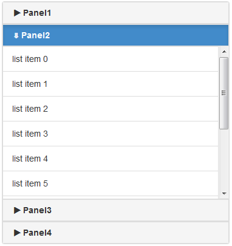
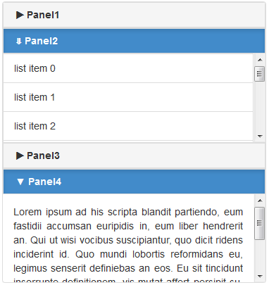

# deliteful/Accordion

``deliteful/Accordion`` is a layout container that display a vertically stacked list of Panels whose titles are all
visible, but only one or at least one panel's content is visible at a time (depending on the singleOpen property value).  
Once the panels are in an accordion, they become collapsible Panels by replacing their headers by ToggleButtons.  
When a panel is open, it fills all the available space with its content.




##### Table of Contents
[Element Instantiation](#instantiation)  
[Element Configuration](#configuration)  
[Element Styling](#styling)  
[User Interactions](#interactions)  
[Element Events](#events)  
[Enterprise Use](#enterprise)  

<a name="instantiation"></a>
## Element Instantiation

See [`delite/Widget`](/delite/docs/master/Widget.md) for full details on how instantiation lifecycle works.

### Declarative Instantiation

```js
require(["deliteful/Accordion", "deliteful/Panel", "requirejs-domready/domReady!"], function () {
});
```

```html
<html>
	<d-accordion id="accordion" selectedChildId="panel1">
		<d-panel id="panel1">
			<div>Content - Panel1 (Default open panel)</div>
		</d-panel>
		<d-panel id="panel2">
			<div>Content - Panel2</div>
		</d-panel>
		<d-panel id="panel3">
			<div>Content - Panel3</div>
		</d-panel>
	</d-accordion>
</html>
```

### Programmatic Instantiation

```js
require([
	"deliteful/Accordion", "deliteful/Panel", "requirejs-domready/domReady!"
], function(Accordion, Panel) {
	var panel1 = new Panel({label: "panel1"});
	var panel2 = new Panel({label: "panel2"});
	var panel3 = new Panel({label: "panel3"});
	var accordion = new Accordion ({singleOpen: false});
	accordion.addChild(panel1);
    accordion.addChild(panel2);
    accordion.addChild(panel3);
    accordion.placeAt(document.body);
});
```

<a name="configuration"></a>
## Element Configuration

`deliteful/Accordion` support `delite` display infrastructure by inheriting from `delite/DisplayContainer`.
For more informations, see [`delite/DisplayContainer`](/delite/docs/master/DisplayContainer.md) documentation.

### Properties

The following properties can be set on a `deliteful/Accordion` instance:

* `singleOpen`: If true, only one panel is open at a time. The current open panel is closed when another panel is open.
If false, several panels can be open at a time. Panels can be closed but there's always at least one open.

* `selectedChildId`: The id of the panel to be open at initialization. If not specified, the default open panel is the first one.
On `singleOpen` mode, this property contains the id of the current open panel.

* `animate`: If true, animation is used when a panel is opened or closed. It doesn't work on IE < 12.

* `openIconClass`: The default CSS class to apply to DOMNode in children headers to make them display an icon when they are
open. If a child panel has its own iconClass specified, that value is used on that panel.

* `closedIconClass`: The default CSS class to apply to DOMNode in children headers to make them display an icon when they are
closed. If a child panel has its own closedIconClass specified, that value is used on that panel.

<a name="styling"></a>
## Element Styling

`deliteful/Accordion` does not provide any CSS class for styling, but the panels can be stylized using the `deliteful/Panel`
CSS classes and the `deliteful/ToggleButton` CSS classes. (TO CHANGE)

The default height of a `deliteful/Accordion` is ``100%``. When the height of a Accordion is expressed as a percentage,
you must ensure that the height of its parent is defined, you must recursively apply the same rule, up to ``<body>`` and
 ``<html>`` elements if needed.
An HTML full-screen application has its ``<body>`` and ``<html>`` elements height set to ``100%``.
You can set height of ``<body>`` and ``<html>`` to ``100%`` by including [`defaultapp.css`](/delite/docs/master/defaultapp.md)


<a name="interactions"></a>
## User Interactions

The user interactions are given by the toggle button used in the panels header. User can activate/deactivate in order to
show/hide (respectively) the content of the panel by:

* Clicking it using a mouse,
* Tapping it on a touch screen device,
* Pressing the SPACE/Enter key when the button has keyboard focus.

Note: On `singleOpen` mode, clicking, tapping or pressing the SPACE/Enter key on the button of the open panel, doesn't has any effect.
Same thing on `multipleOpen` mode when there's only one open panel. In both case, in order to keep at least one panel open at a time.

<a name="events"></a>
## Element Events
`deliteful/Accordion` support `delite` display events by inheriting from `delite/DisplayContainer`.
For more informations, see [`delite/DisplayContainer`](/delite/docs/master/DisplayContainer.md) documentation.

<a name="enterprise"></a>
## Enterprise Use

### Accessibility

|type|status|comment|
|----|------|-------|
|Keyboard|partial|Panels can be open/closed by pressing the SPACE/Enter key when its Toggle Button has keyboard focus|
|Visual Formatting|||
|Screen Reader|||

### Globalization

`deliteful/Accordion` does not provide any internationalizable bundle.

### Security

This widget has no specific security concern. Refer to [`delite/Widget`](/delite/docs/master/Widget.md) for general security advice on this base class.

### Browser Support

This widget supports all supported browsers. On Internet Explorer, transitions are not animated.

